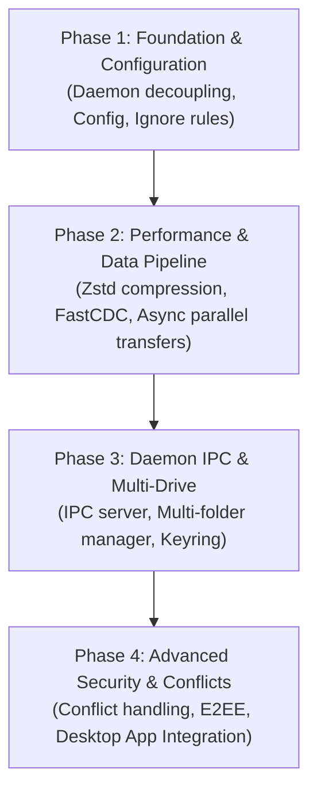

# Phaneros Core Development Roadmap

This document outlines the complete feature set and implementation roadmap for evolving `phaneros` from a CLI prototype into a production-grade background synchronization engine.

---

## 📋 Comprehensive Todo List

### 1. Architecture & Daemon Decoupling (User Feature)
- [x] **Split Codebase into Crate Modules**
  - [x] Extract core sync & state logic into `phaneros-core`.
  - [x] Refactor `phaneros-cli` into a thin CLI client binary.
  - [x] Create `phaneros-daemon` as a background service binary host.
  - [x] Expose `phaneros-core` library interface (`SyncEngine`) for embedding in Desktop apps (Tauri/Electron).
- [ ] **Daemon IPC Server Layer**
  - [ ] Implement Unix Domain Socket (Unix/macOS) & Named Pipe (Windows) transport.
  - [ ] Implement JSON-RPC / gRPC protocol for IPC commands (`status`, `pause`, `drive add`, `rescan`).
  - [ ] Add event streaming (sync progress, speed, status events) for UI consumption.
- [x] **Daemon Configuration Engine (User Feature)**
  - [x] Define standard `config.toml` schema and OS-specific config directory resolution (`dirs` / `toml`).
  - [x] Support global daemon options (`daemon.store_url`, log levels, IPC path).
  - [x] Support multi-drive sync configurations (`[drives.<id>]` table format).
  - [x] Support CLI option overrides over configuration file values.

---

### 2. Compression & Transfer Engine (User Feature + Engine Enhancement)
- [x] **Blob Compression (Zstd)**
  - [x] Implement Zstd compression (`zstd-rs`) level 3 for chunk payload uploads.
  - [x] Maintain content-addressable indexing by hashing **uncompressed** bytes (`SHA-256` / `BLAKE3`).
  - [x] Add adaptive compression bypass (keep raw bytes if compression does not reduce size).
  - [x] Update `phaneros-store` with database migration (`0002_blob_compression.sql`) and `Content-Encoding: zstd` headers.
- [ ] **Parallel Async Transfer Pipeline**
  - [ ] Migrate `HttpBlobRepository` from synchronous `ureq` sequential calls to `tokio` + `reqwest` async streams.
  - [ ] Implement bounded worker pools for concurrent chunk uploads and downloads.
  - [ ] Add connection retry logic with exponential backoff for network resilience.

---

### 3. Chunking & File System Logic (Engine Enhancement)
- [x] **Content-Defined Chunking (FastCDC)**
  - [x] Replace fixed 1 MB chunking with `FastCDC` rolling hash chunk boundaries.
  - [ ] Benchmark differential sync performance on large, slightly modified files.
- [x] **Ignore Pattern Engine (`.phanerosignore`)**
  - [x] Integrate `ignore` crate to parse `.phanerosignore` and `.gitignore` files.
  - [x] Skip system temporary files, `.DS_Store`, build artifacts (`target/`, `node_modules/`), and `.git/`.
  - [x] Support recursive ignore file discovery across subdirectories.

---

### 4. Security, Resilience & Conflicts (Engine Enhancement)
- [ ] **Secure Credential Storage**
  - [ ] Integrate `keyring-rs` for storing store tokens and secrets in the OS Keyring/Keychain instead of plain text.
- [x] **Conflict Resolution Strategy**
  - [x] Implement conflict detection during local/remote state merge.
  - [x] Implement file conflict policy (e.g. creating `.conflict` / `.conflict-delete` suffixed files for conflicting edits/deletes).
- [ ] **End-to-End Encryption (E2EE - Optional/Advanced)**
  - [ ] Implement client-side zero-knowledge AEAD chunk encryption (`XChaCha20-Poly1305`) before storage/upload.

---

## 🎯 Priority Matrix & Phased Execution Plan

The roadmap is structured into 4 sequential execution phases based on architectural dependencies:

### Phase 1: Core Foundation & Configuration (Completed)
> **Goal:** Create a solid foundation by separating the daemon from the CLI, adding persistent configuration, and preventing wasteful file indexing.

1. [x] **Decouple CLI & Daemon Workspace**: Restructure workspace crates into `phaneros-core`, `phaneros-daemon`, and `phaneros-cli`.
2. [x] **Daemon Config Engine**: Implement `config.toml` reading/saving using standard OS paths (`dirs` / `toml`).
3. [x] **File Ignore Engine**: Add `.phanerosignore` and `.gitignore` support using the `ignore` crate to skip build artifacts (`node_modules/`, `target/`, `.git/`, `.DS_Store`).

---

### Phase 2: Chunk & Transfer Optimization (In Progress)
> **Goal:** Elevate transfer speeds, minimize network usage, and enable efficient differential file sync.

1. [x] **Zstd Blob Compression**: Compress chunks before upload using Zstd at level 3, while preserving uncompressed content hashing (`SHA-256` / `BLAKE3`) and transparent decompression.
2. [x] **FastCDC Variable Chunking**: Replace 1MB fixed chunks with content-defined chunking to maximize deduplication across edits.
3. [ ] **Async Parallel Transfer Pipeline**: Replace sequential `ureq` transfers with a `tokio` concurrent async worker pool.

---

### Phase 3: Daemon IPC & Multi-Drive Sync
> **Goal:** Make the daemon instantiable, controllable remotely, and capable of handling multiple folders simultaneously.

1. [ ] **IPC Server Layer**: Add UDS / Named Pipe listener to daemon for RPC commands (`phaneros start`, `phaneros status`, `phaneros pause`).
2. [ ] **Multi-Drive Manager**: Allow daemon to run multiple concurrent watcher/syncer engines for different drive folders.
3. [ ] **Secure Token Storage**: Integrate `keyring-rs` to securely store remote store authentication tokens.

---

### Phase 4: Resilience, Security & GUI Integration
> **Goal:** Ensure data integrity during offline/conflict states and provide rich IPC events for desktop apps.

1. [x] **Conflict Resolution Policy**: Detect simultaneous modifications and handle conflict file generation cleanly (`.conflict` & `.conflict-delete`).
2. [ ] **IPC Event Streaming**: Expose real-time progress events for Tauri/Electron Desktop GUIs.
3. [ ] **Client-Side E2EE (Zero-Knowledge)**: Optional client-side chunk encryption before upload.

